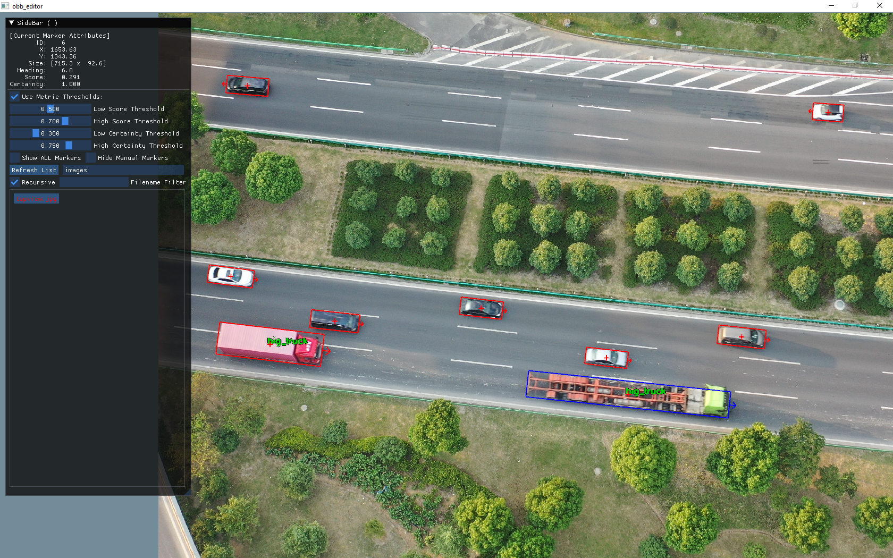

# An Oriented Bounding Box Labeling Tool on Windows, Linux and Chrome.

 * *__obb_editor__ is implemented using OpenGL, Dear ImGui, SDL2 and emscripten.*

## How to use obb_editor
* On Launch
  * The Native executable version shows files from the "build/images" folder.
    * To view other images, either move them to the "build/images" folder,
      * Or change the folder/path name on the sidebar and press "Refresh List"
  * On WebAssembly, it loads a built-in list of images.
    * To open local images, press the "Open Folder..." button
      * and allow the browser to *view files* from the folder.
* Operations
  * Mouse
    * Left Button Drag: Move the image
    * Scroll: Scale the image
    * Right Button Drag: Move the box or rotate the box (depending whether box center is seleced)
    * Right Button Click: Tweak length/width of box (depending where it's clicked)
    * Middle Button Click: Invert the heading direction of current box
  * Hotkeys
    * Key s: Save labeling results (*.vehicle_markers.json)
    * Key z: Undo modification
    * Key c: Redo modification
    * Key o: Open folder (Emscripten only)
    * Key d: Hide current box
    * Key 0: Set vehicle type - car
    * Key 1: Set vehicle type - bus
    * Key 2: Set vehicle type - mini_bus
    * Key 3: Set vehicle type - truck
    * Key 4: Set vehicle type - van
    * Key 5: Set vehicle type - motorcycle
    * Key 6: Set vehicle type - cyclist
    * Key 7: Set vehicle type - ped
    * Key 8: Set vehicle type - big_truck
    * Key 9: Set vehicle type - dont_care
    * Left SHIFT: Show all boxes
    * Left ALT: Hide manually created boxes

## Windows and Linux Build
* CMake Generate and Build
  * mkdir build
  * cd build
  * cmake ..
  * cmake --build . -j 8
* Run the Native Executable
  * Linux
    * ./obb_editor
  * Windows
    * Debug/obb_editor

## Emscripten build
* Setup Emscripten Environment ([Install](https://emscripten.org/docs/getting_started/downloads.html))
  * Linux
    * emsdk\emsdk_env.sh
  * Windows
    * emsdk\emsdk_env.bat
* CMake Generate and Build
  * mkdir h5build
  * cd h5build
  * emcmake cmake ..
  * cmake --build . -j 8
* Run the WebAssembly Build
  * python -m http.server
  * Open http://127.0.0.1:8000/obb_editor.html in Chrome